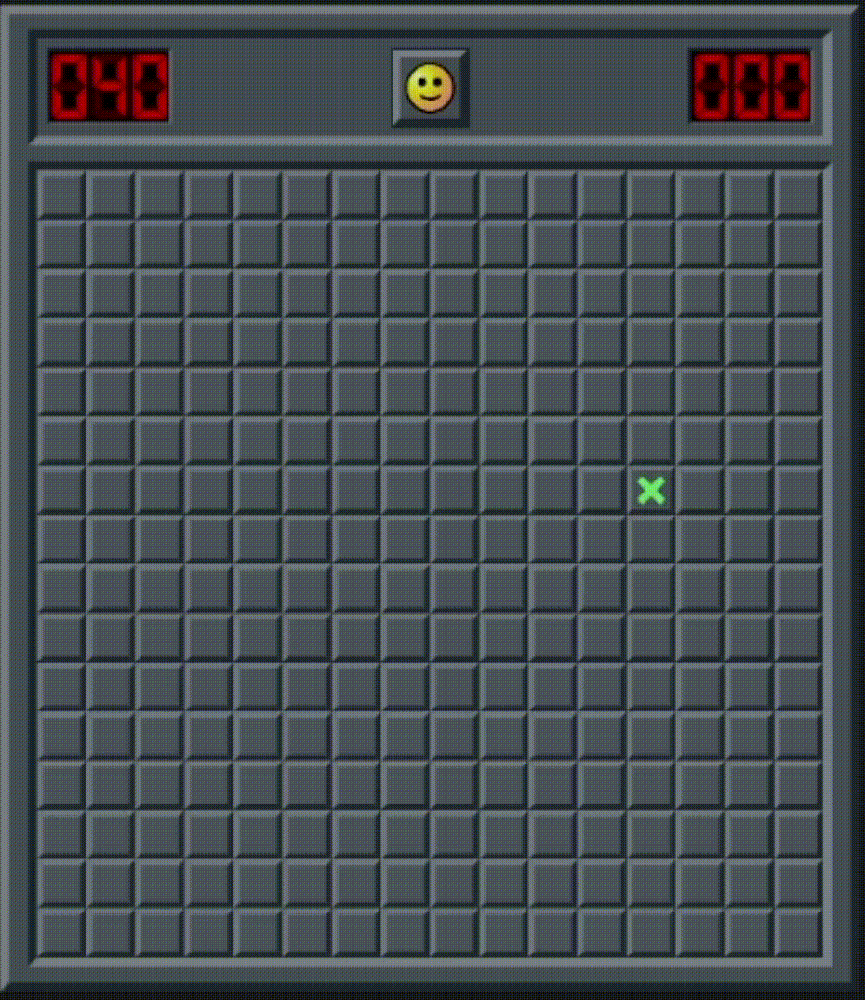

# Sweeper
<p align="center">
    
</p>
A fully automated Minesweeper solver written in Python that uses screen capture and logical reasoning to play the game. The project is currently a work in progress.  

## Installation

### 1. Clone the repository
```bash
git clone https://github.com/ddsdAlp/sweeper.git
cd sweeper
```
### 2. Create and activate the virtual environment
- Windows
```bash
python -m venv .venv
.venv\Scripts\activate
```
- macOS / Linux
```bash
python -m venv .venv
source .venv/bin/activate
```
### 3. Install dependencies
```bash
pip install -r requirements.txt
```
## Usage
1. Open 'minesweeper.online' in your browser
2. Run the 'calibration.py' script to detect board coordinates
3. Adjust coordinates in 'config.py' if needed
4. Run the solver ('main.py')

## Limitations
- Requires fixed screen resolution and browser position
- Only suitable for the "no guessing" mode

## Disclaimer
Automated scripts and programs that can perform clicks and assists in solving the game are considered cheating on minesweeper.online and are restricted by the website.<br><br>
This project is provided strictly **for educational purposes only**.<br><br>
I do not encourage or endorse the use of this software to gain unfair advantage or to bypass website rules. By using this project, you acknowledge that you are doing so **at your own risk and responsibility**.<br><br>
This repository is not affiliated with or endorsed by minesweeper.online.

